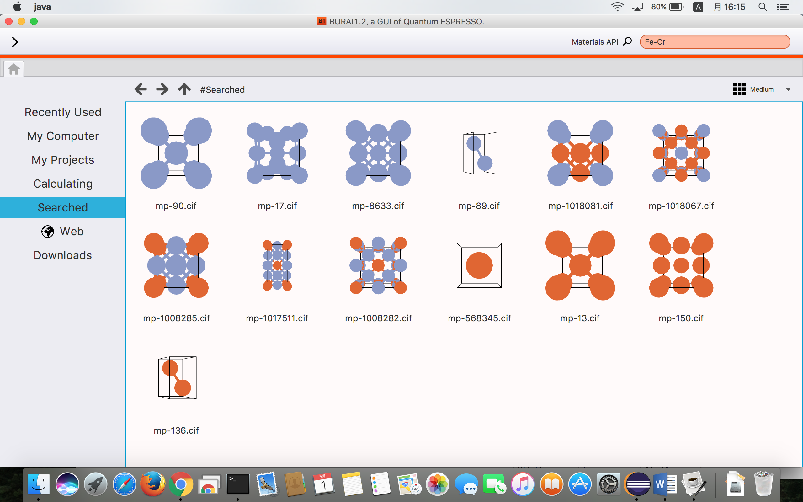
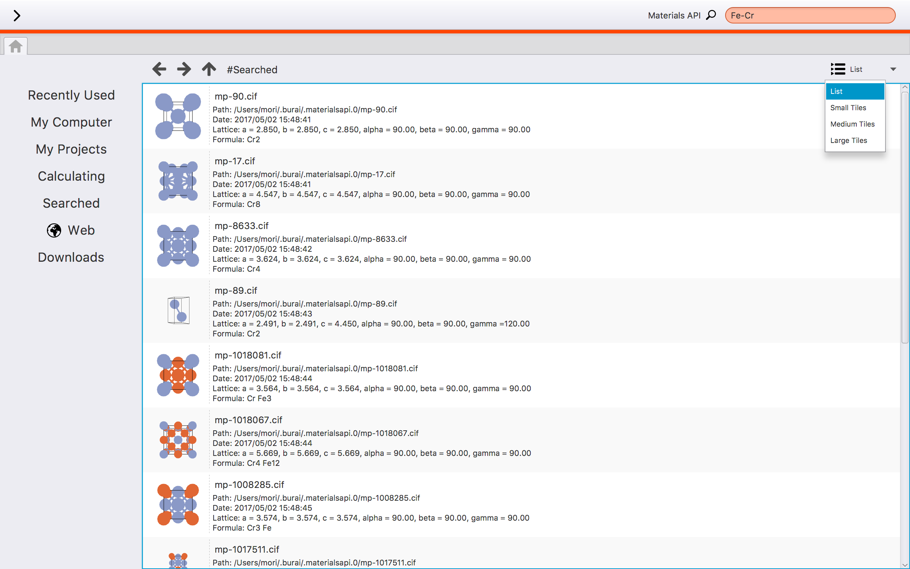
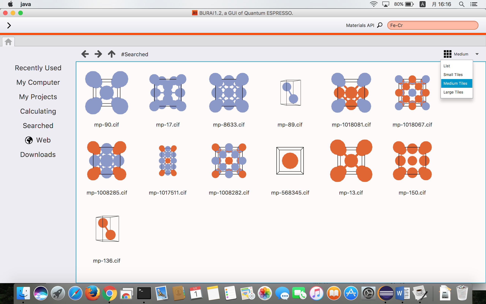
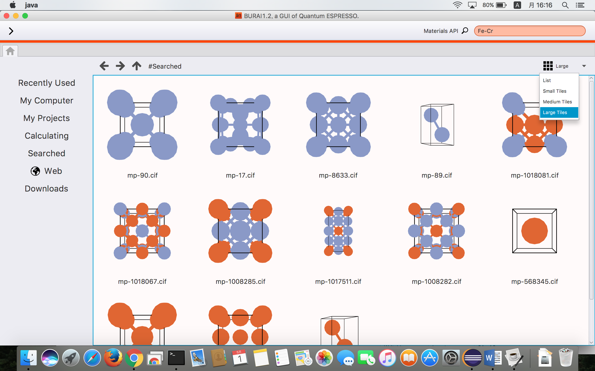
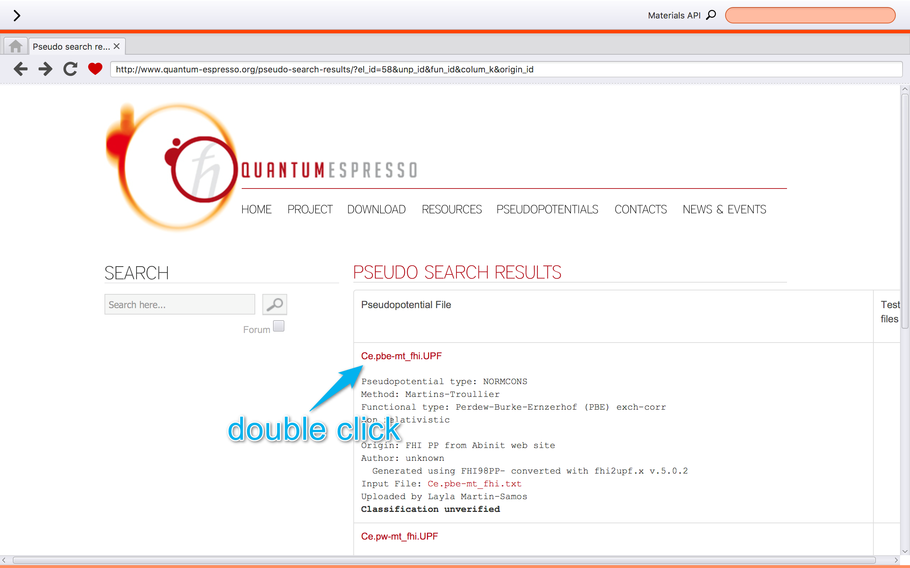
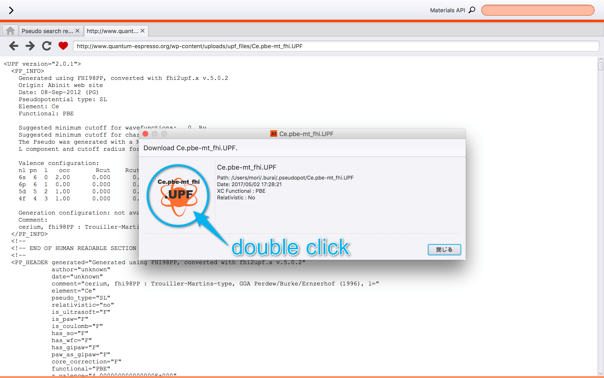
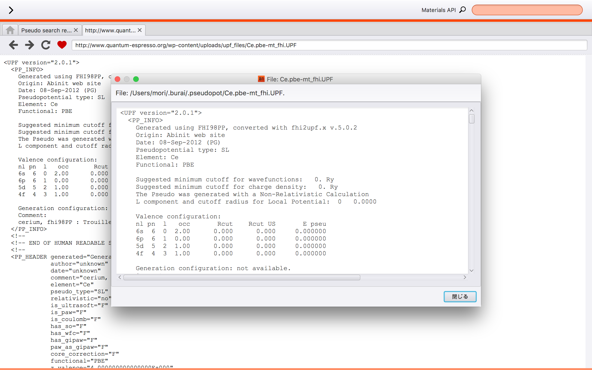

How to use BURAI
================

Window layout
-------------
Figure 1 shows the window layout of BURAI.

.. image:: ../img/imgWindowStructure_window_all.png
   :scale: 100 %
   :align: left

Figure 1. The window layout of BURAI

1. Menu bar
^^^^^^^^^^^

menu bar include the links of Quantum ESPRESSO solver's manual and BURAI's one, and proxy server setting.

.. image:: ../img/imgWindowStructure_menubar.png
   :scale: 80 %
   :align: center

| 
| 

2. Material Project API
^^^^^^^^^^^^^^^^^^^^^^^

BURAI can get crystal structure form `Material Project <https://materialsproject.org/>`_ by using its API.

| 
| 

3. Home tab
^^^^^^^^^^^

The Home tab include the explore that consists of menu list and controlor. 

.. image:: ../img/imgWindowStructure_hometab.png

| Figure X, home tab
| 

Initial setting
---------------

if you use under the proxy system, you have to set up at "Proxy server" of menu.

.. image:: ../img/imgWindowStructure_proxyServer.png
   :scale: 80 %
   :align: center

| 

File explorer
-------------

The file explore of this system consist of getting from crystal database, keeping calculated data, and moving
the directory like another os's file explorer.

1. Operating
^^^^^^^^^^^^

You can control this system by using left menu. Figure XX shows the left menu list.

add file system image

.. image:: ../img/imgWindowStructure_leftmenu.png
   :scale: 80 %
   :align: center
   
Figure X. The left menu list of BURAI

| 
| 
| 

2. File system
^^^^^^^^^^^^^^

The folder or calculated data are shown by 

add file system image

.. image:: ../img/imgWindowStructure_menubar.png
   :scale: 80 %
   :align: center

| 
| 

3. Supporting file format
^^^^^^^^^^^^^^^^^^^^^^^^^

This system is supporting at `CIF format <https://en.wikipedia.org/wiki/Crystallographic_Information_File>`_, `XYZ format <https://en.wikipedia.org/wiki/XYZ_file_format>`_, and Quantum ESPRESSO input file.
Also, this system is applied to the drag-and-drop. Therefore, you can do drag-and-drop these file 
which you want to calculate.

add drag-and-drop image

.. image:: ../img/imgWindowStructure_menubar.png
   :scale: 80 %
   :align: center
| 
| 

Material project API
--------------------

This system can get crystal structures by using the Material projects API.

For example, if you want to calculate the Fe-Cr system, you enter "Fe Cr" in the Material projects API bar as indicated in the figure XX.

Also, the searched material lists are shown in several method (List, small tiles, medium tiles, and large tiles).

1. List

   
2. Small tiles  
 
.. image:: ../img/imgMaterialProject_smallTiles.png
   :scale: 100 %
   :align: center

3. Medium tiles
    

4. Large tiles   

** if you stop searching, you enter space and push the return key in Material project bar.

Web
---

This system can be used as the internet explore.

1. Operation
^^^^^^^^^^^^^^^^^^^

When you search something at the internet, you select "Web" in this system control.

.. image:: ../img/imgWeb_default.png
   :scale: 100 %
   :align: center
   

Google URL have been resisted at bookmark as default.

.. image:: ../img/imgWeb_default.png
   :scale: 100 %
   :align: center

2. link menu
^^^^^^^^^^^^

3. getting crystal structure database
^^^^^^^^^^^^^^^^^^^^^^^^^^^^^^^^^^^^^

On this system, you search the crystal structure which you want to calculate, and you can easily use the model. In short, everything operation is able to be done on BURAI system.

Figures show the getting crystal data, and using as model.

The first step is searching the crystal data on web.

.. image:: ../img/imgWeb_searchNaCl00.png
   :scale: 100 %
   :align: center

The second step is clicking the crystal data link. 
The moment you click the link of cif format, the window appears.
The window include crystal model and informations.
   
.. image:: ../img/imgWeb_searchNaCl01.png
   :scale: 100 %
   :align: center

Finally, you click the model of the window, then the crystal structure is appeared in quantum ESPRESSO inoput window.
   
.. image:: ../img/imgWeb_searchNaCl02.png
   :scale: 100 %
   :align: center

4. getting pseudopotential
^^^^^^^^^^^^^^^^^^^^^^^^^^

When you use the pseudopotential, which is not resisted in BURAI, you download it form a pseudopotential site, and you can use it.

   

   

   

Create QE project
-----------------
.

