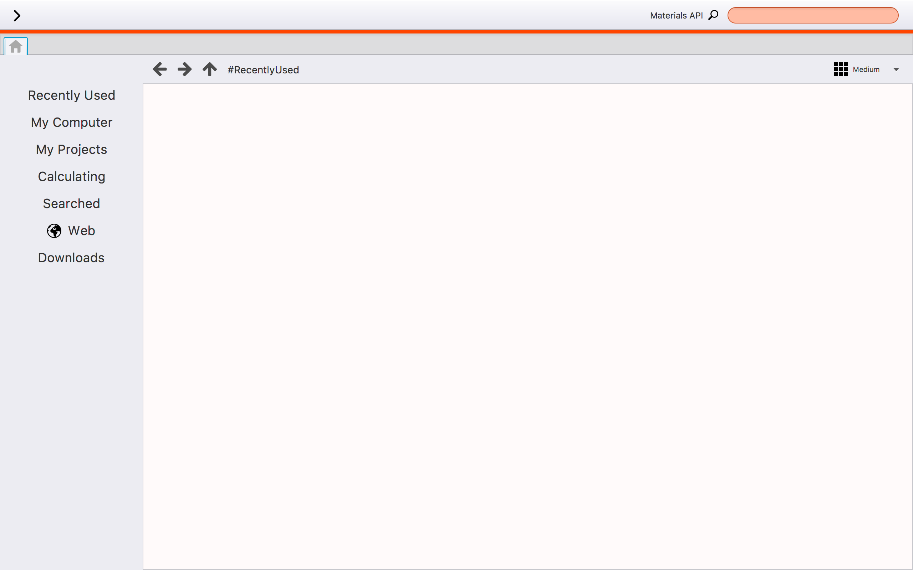
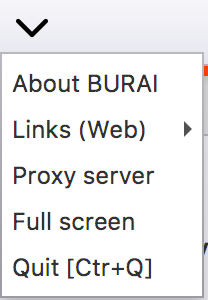
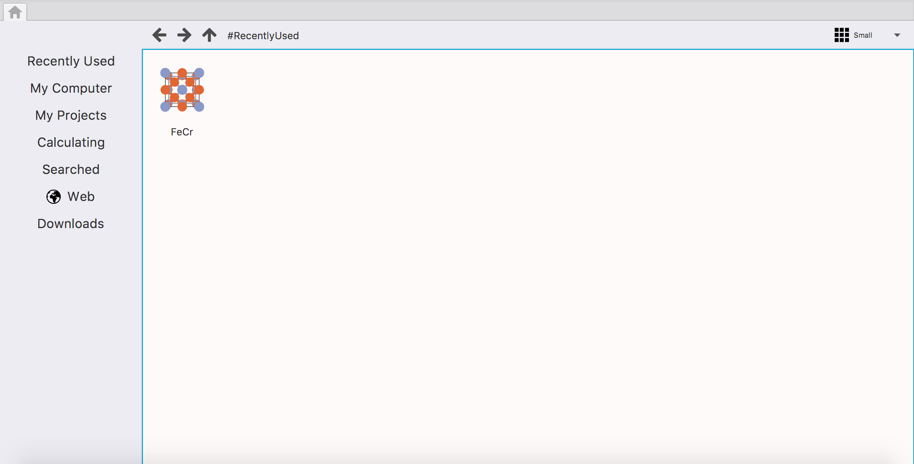

How to use BURAI
================

Window layout
-------------
Figure 1 shows the window layout of BURAI.

Figure 1. The window layout of BURAI

1. Menu bar
^^^^^^^^^^^

menu bar include the links of Quantum ESPRESSO solver's manual and BURAI's one, and proxy server setting.

| 
| 

2. Material Project API
^^^^^^^^^^^^^^^^^^^^^^^

BURAI can get crystal structure form `Material Project <https://materialsproject.org/>`_ by using its API.

| 
| 

3. Home tab
^^^^^^^^^^^

The Home tab include the explore that consists of menu list and controlor. 

| Figure X, home tab
| 

Initial setting
---------------

if you use under the proxy system, you have to set up at "Proxy server" of menu.

.. image:: img/imgWindowStructure_proxyServer.png
   :scale: 80 %
   :align: center

| 

File explorer
-------------

The file explore of this system consist of getting from crystal database, keeping calculated data, and moving
the directory like another os's file explorer.

1. Operating
^^^^^^^^^^^^

You can control this system by using left menu. Figure XX shows the left menu list.

add file system image

.. image:: img/imgWindowStructure_leftmenu.png
   :scale: 80 %
   :align: center
   
Figure X. The left menu list of BURAI

| 
| 
| 

2. File system
^^^^^^^^^^^^^^

The folder or calculated data are shown by 

add file system image

| 
| 

3. Supporting file format
^^^^^^^^^^^^^^^^^^^^^^^^^

This system is supporting at `CIF format <https://en.wikipedia.org/wiki/Crystallographic_Information_File>`_, `XYZ format <https://en.wikipedia.org/wiki/XYZ_file_format>`_, and Quantum ESPRESSO input file.
Also, this system is applied to the drag-and-drop. Therefore, you can do drag-and-drop these file 
which you want to calculate.

add drag-and-drop image

| 
| 

Material project API
--------------------

Web
---

1. Operating method
^^^^^^^^^^^^^^^^^^^

2. link menu
^^^^^^^^^^^^

3. getting crystal structure database
^^^^^^^^^^^^^^^^^^^^^^^^^^^^^^^^^^^^^

4. getting pseudopotential
^^^^^^^^^^^^^^^^^^^^^^^^^^

Create QE project
-----------------
.

