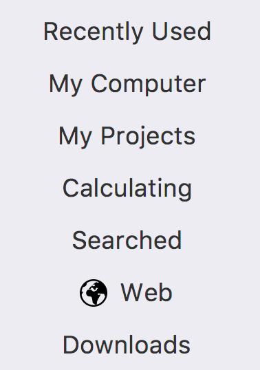
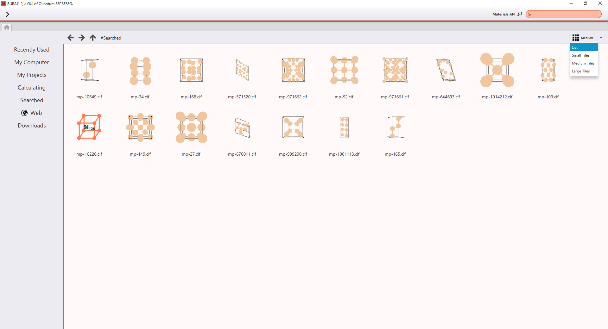

Explorer
========

Following items control states of the explorer.

|
.. csv-table:: Item of left sidebar
    :header: "Item", "Explanation"
    :widths: 15, 35

    "Recently Used", "Recently used files."
    "My Computer", "The root directory (Windows: C¥, MacOSX: /)."
    "My Projects", "The directory where projects are saved. ($HOME/.burai/)."
    "Calculating", "Calculating projects."
    "Web", "Bookmarks of web sites."
    "Downloads", "Downloaded files form web sites."

| 
Moreover, the items of center window is depicted by 4 types (List, Small Tiles, Medium Tiles and Large Tiles).

|
Right click the mouse on the file explore, users can make directory.
Right click the mouse on the directory or bookmark, users can delete or open it by selecting menu.

File System
-----------

In the case of Quantum ESPRESSO projects or crystal structure data folder, the crystal structure is shown instead of folder image.

File Format
-----------

This system is supporting at `CIF format <https://en.wikipedia.org/wiki/Crystallographic_Information_File>`_, `XYZ format <https://en.wikipedia.org/wiki/XYZ_file_format>`_, and Quantum ESPRESSO input file.
Also, this system is applied to the drag-and-drop. Therefore, you can do drag-and-drop the file which you want to calculate.
