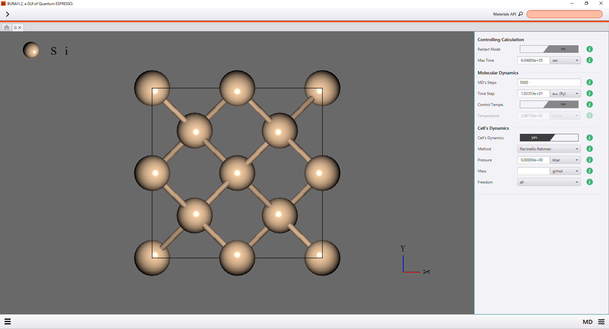

MD
==

In case users set the condition of first-principles molecular dynamics, users select "MD" from right menu.
Also, users should set the condition after or before user set scf condition.

.. image:: ../../../img/input_editor/imgCreateJob_MD00.png
   :scale: 50 %
   :align: center

|
.. csv-table:: MD
    :header: "No.", "Name", "Details"
    :widths: 10, 10, 35

    "1", "Restart Mode", "if users would like to to continue an interrupted calculation, users select yes."
    "2", "Max Time", "Job stops after users set CPU time."
    "3", "MD's Step", "number of molecular-dynamics steps"
    "4", "Ime Step", "time step for molecular dynamics"
    "5", "Control Tempe.", "select whether control ionic temperature or not."
    "6", "Temperature", "target temperature"
    "7", "Cell's Dynamics", "select whether variable-cell or not."
    "8", "Method", "Select the extended lagrangian method"
    "9", "Pressure", "Target pressure"
    "10", "Mass", "Fictitious cell mass"
    "11", "Freedom", "Select which of the cell parameters should be moveds"

if Control Tempe. is "yes", users can input Temperature.

|
.. image:: ../../../img/input_editor/imgCreateJob_MD01.png
   :scale: 50 %
   :align: center

if Cell's Dynamics. is "yes", users can input Method, Pressure, Mass, and Freedom.

|

In addition, users can conform input condition form input-file of left menue.

|
.. image:: ../../../img/input_editor/imgCreateJob_CheckInputFIle.png
   :scale: 50 %
   :align: center

