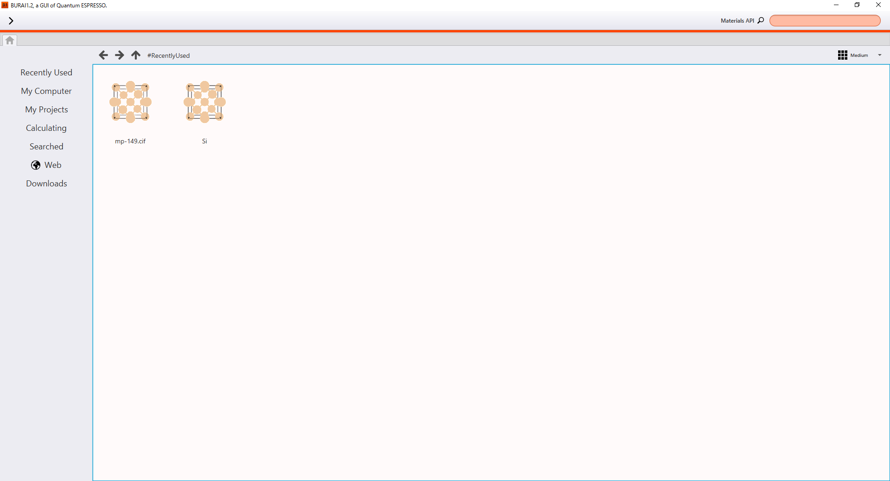

Layout of Window
================

This page explains the layout of BURAI platform, and summarizes its overview of each part
(top bar, main home tub, and left sidebar of home tab).

Top bar
-------

Top bar was built of two items.

1. Trigger type menu.
2. Materials API

* Trigger type menu

Trigger type menu has eight items. Also > icon can open Trigger type menu.

.. csv-table:: Item of Trigger type menu
    :header: "Item", "explanation"
    :widths: 25, 35

    "About BURAI", "BURAI information, version, and license are shown."
    "Documents", "BURAI manual is shown"
    "Links (Web)", "Quantum ESPRESSO (QE) Home page and each QE solver page links are inclued."
    "Path of QE", "Setting and Showing QE and MPI Path."
    "Proxy server", "Setting proxy system."
    "Full screen", "BURAI windows size are changed full screen."
    "Quit [Ctr +Q]", "BURAI platform are finished."

* Materials API
BURAI can get crystal structure by using `Materials API <https://materialsproject.org/>`_ .
Therefore, users have to enter element symbols into the bar of Materials API.
The detailed explanation is shown in Materials API content (add link).

Home tab
--------

Home tab is built from the left sidebar and center window.
Its left sidebar has seven items. In case users select item of left sidebar,
its item information is shown in center window. Thus, when user start BURAI platform,
the history of Recently Used content is shown in its center window.

.. csv-table:: Item of left sidebar
    :header: "Item", "explanation"
    :widths: 25, 35

    "Recently Used", "The history which users used, is shown in center window."
    "My Computer", "In the case of windows system, C drive (system drive) is shown in center window.In the case of Mac OS, users home directory is shown."
    "My Projects", "The QE project which users saved, and Examples are shown in the center window."
    "Calculating", "Calculating content shows the state of QE calculating."
    "Web", "Bookmark list is saved. Google URL is set in the Web item from the begining."
    "Downloads", "The files which users downloaded, are shown."

Moreover, the items of center window is depicted by 4 types (List, Small Tiles, Medium Tiles and Large Tiles).

.. image:: ../../img/layout/ShowingMethod.gif
   :scale: 50 %
   :align: center

