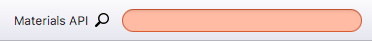

Layout of Window
================

This page shows the initial window of BURAI as

Header bar
----------

Header bar has two items:

1. Main menu.
2. Materials API

* Main menu

Main menu, which is symbolized ">" icon, has eight items.

.. image:: ../../img/layout/TriggerMenu.gif
   :scale: 50 %
   :align: left

| 
.. csv-table:: Items of main menu
    :header: "Item", "Explanation"
    :widths: 15, 35

    "About BURAI", "BURAI information, where version and license are shown."
    "Documents", "This documantation is shown."
    "Links (Web)", "Some links (QE web page, psudopotential page ...)"
    "Path of QE", "Set and Show QE and MPI paths."
    "Proxy server", "Set proxy system."
    "Full screen", "BURAI windows size are changed full screen."
    "Quit [Ctr + Q]", "Quit the system of BURAI."

* Materials API

You can get crystal structure through `Materials API <https://materialsproject.org/>`_. 

| Please see `here <materialsAPI.html>`_ for the details.

| 

Home tab
--------

Home tab, which is located under header bar, has explorer system. 

| Please see `here <explorer.html>`_ for the details of the explorer.

.. image:: ../../img/layout/HomeTab.png
   :scale: 50 %
   :align: left

