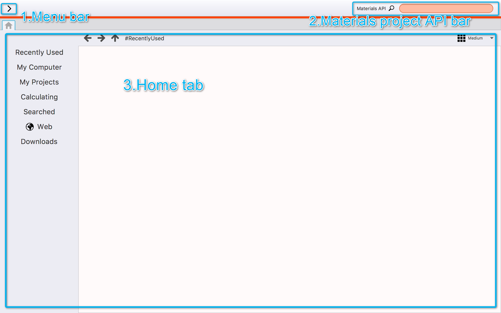

Layout of Window
================

This system's window consists of the menu, searching crystal structure bar, and hometab.

.. csv-table:: Frozen Delights!
    :header: "Treat", "Quantity", "Description"
    :widths: 15, 10, 30

    "Albatross", 2.99, "On a stick!"
    "Crunchy Frog", 1.49, "If we took the bones out, it wouldn't be
    crunchy, now would it?"
    "Gannet Ripple", 1.99, "On a stick!"

