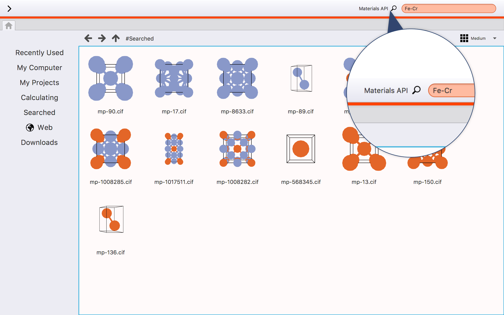

Materials API
=============

You can get crystal structure through `Materials API <https://materialsproject.org/>`_ .

The element symbol and chemical formulas ware entered in the Materials API bar, 
then this system search the crystal structure which has entered the element.

If you want to search the Fe-Cr system, you should enter "Fe Cr" or "Fe-Cr" 
in the Materials API bar as indicated in the following figure.

BURAI searches the crystal structure that Fe and/or Cr is included.
If successful, the list of crystal structure is showed.

.. image:: ../../img/imgMaterialProject_search.png
   :scale: 30 %
   :align: center

