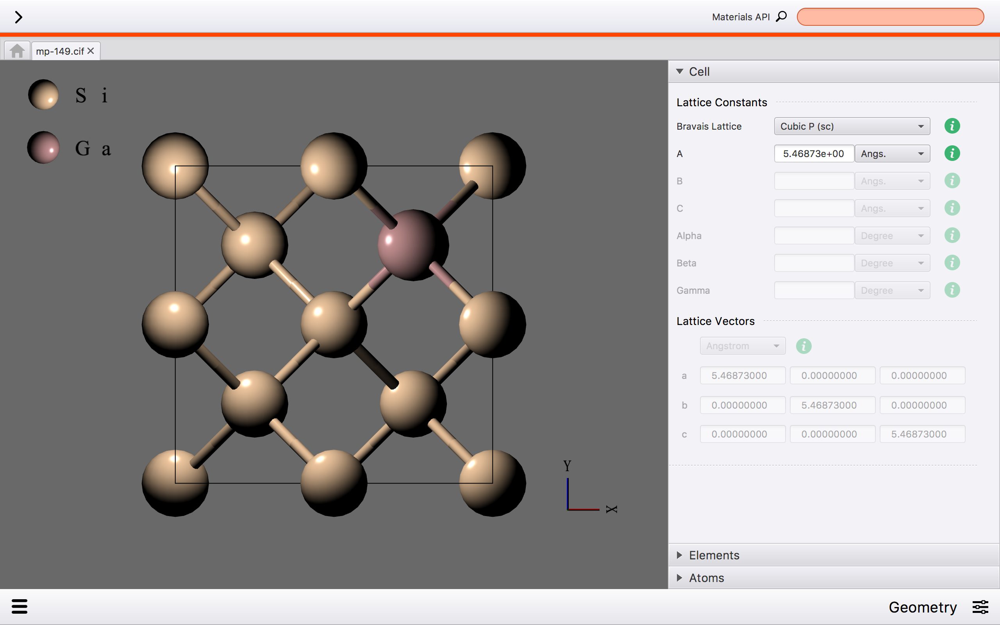
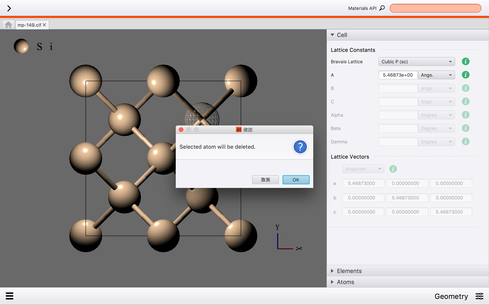
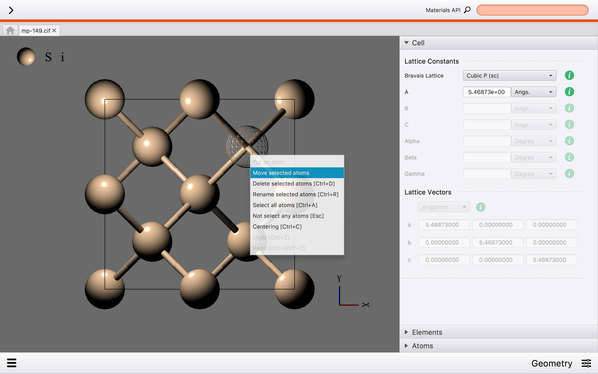
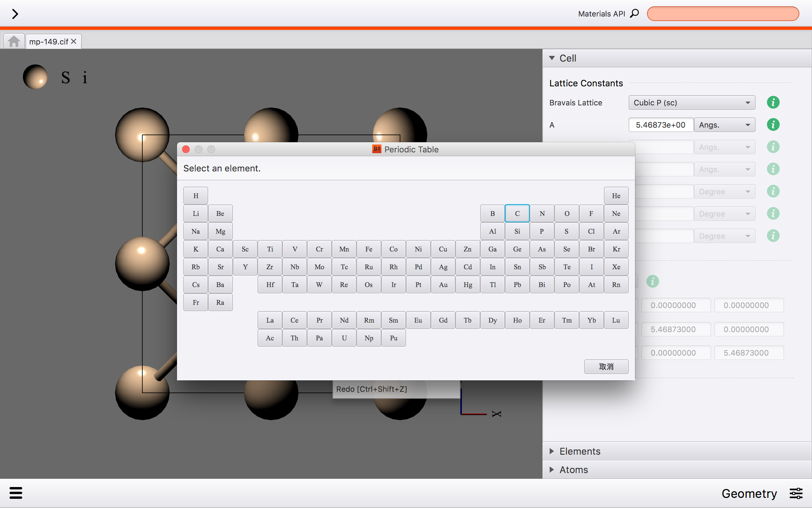
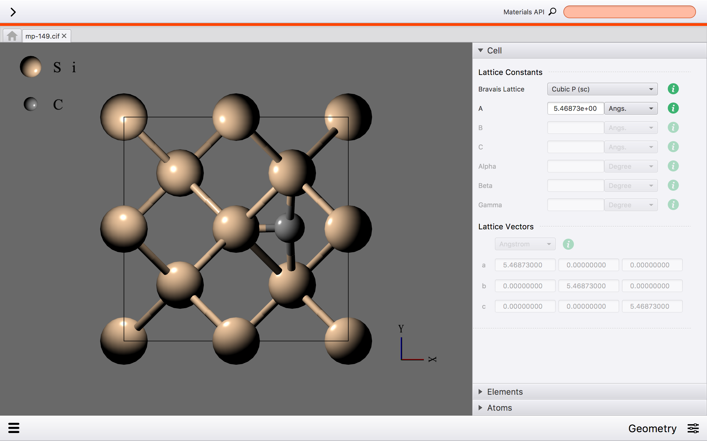

Atoms Viewer
============

This system can replace, delete, move, and add the atom.
This chapter explain these operations.

Replace Atom
------------
We introduce the operation of replace the atom.
The first step is selecting the atom which you want to replace.
Then, the menu appears. You select “Rename selected atoms”

.. image:: ../../../img/projects/imgCreateJob_ReplaceAtom01.png
   :scale: 30 %
   :align: center

The periodic table appears, and you select element which you want to replace.

.. image:: ../../../img/projects/imgCreateJob_ReplaceAtom02.png
   :scale: 30 %
   :align: center

You can replace the atom.

Delete Atom
-----------
We introduce the operation of delete the atom.
The first step is selecting the atom which you want to delete.
Then, the menu appears. You select “Delete selected atoms”

.. image:: ../../../img/projects/imgCreateJob_DeleteAtom00.png
   :scale: 30 %
   :align: center

The confirmation screen appears.

You select “OK”, and you can delete the atom.

.. image:: ../../../img/projects/imgCreateJob_DeleteAtom02.png
   :scale: 30 %
   :align: center

Move Atom
---------
We explain the operation that selected atom is moved.
The first step is selecting the atom which you want to move.
Then, the menu appears. You select “Move selected atoms”

The green plane surface appears on the model. The plane surface means the area that the selected atom can move.

.. image:: ../../../img/projects/imgCreateJob_MoveAtom01.png
   :scale: 30 %
   :align: center

You decide the area, and you move the atom.

.. image:: ../../../img/projects/imgCreateJob_MoveAtom02.png
   :scale: 30 %
   :align: center

.. image:: ../../../img/projects/imgCreateJob_MoveAtom03.png
   :scale: 30 %
   :align: center

Add Atom
--------
We introduce the operation of put the atom.
The first step is clicking the area which you want to put the atom, then menu window appears. You select “Put an atom”

.. image:: ../../../img/projects/imgCreateJob_PutAtom00.png
   :scale: 30 %
   :align: center

The periodic table appears, and you select element which you want to add in the area.

After you select the element, you can put the atom.

