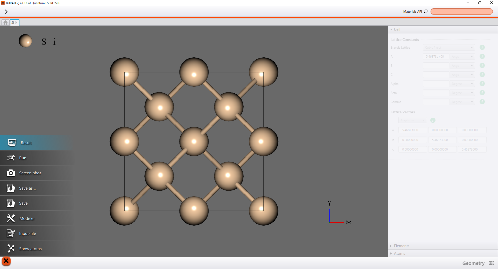
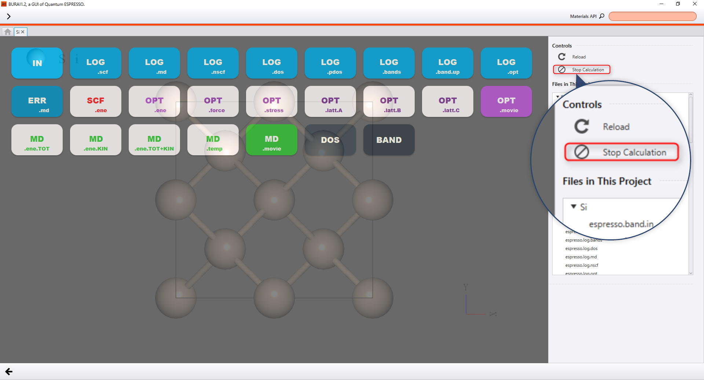

Calculation
===========

In project tab you can post a calculation, as the following.

Post a Calculation
------------------

Selecting "Run" from the menu of the left-hand side, you can post a calculation.

+----------------------------------------------------------------+
| .. image:: ../../../img/projects/imgCreateJob_running00.png    |
|    :scale: 40 %                                                |
|    :align: center                                              |
+----------------------------------------------------------------+

| 

| The project has to be saved before a calculation, if not saved.
| Then, set the numbers of MPI and OpenMP parallelization and press the "OK", to post a calculation.

+--------------------------------------------------------------------+
| |                                                                  |
| | **Step1**                                                        |
+--------------------------------------------------------------------+
| .. image:: ../../../img/projects/imgCreateJob_running01.png        |
|    :scale: 80 %                                                    |
|    :align: center                                                  |
+--------------------------------------------------------------------+
| |                                                                  |
| | **Step2**                                                        |
+--------------------------------------------------------------------+
| .. image:: ../../../img/projects/imgCreateJob_running02.png        |
|    :scale: 80 %                                                    |
|    :align: center                                                  |
+--------------------------------------------------------------------+

| 

After posting a calculation, the job scheduler is shown in the home tab.
Posted jobs will be executed one after another.

+------------------------------------------------------------------+
| .. image:: ../../../img/projects/imgCreateJob_running03.png      |
|    :scale: 40 %                                                  |
|    :align: center                                                |
+------------------------------------------------------------------+
| |                                                                |
| | Status of job                                                  |
+=========+========================================================+
| Green   | Job is finished.                                       |
+---------+--------------------------------------------------------+
| Red     | Job is running.                                        |
+---------+--------------------------------------------------------+
| Yellow  | Job is in the queue (not running).                     |
+---------+--------------------------------------------------------+

| 

Stop a Calculation
------------------

In case users want to stop the calculating,

|
user should push "Stop Calculation"

