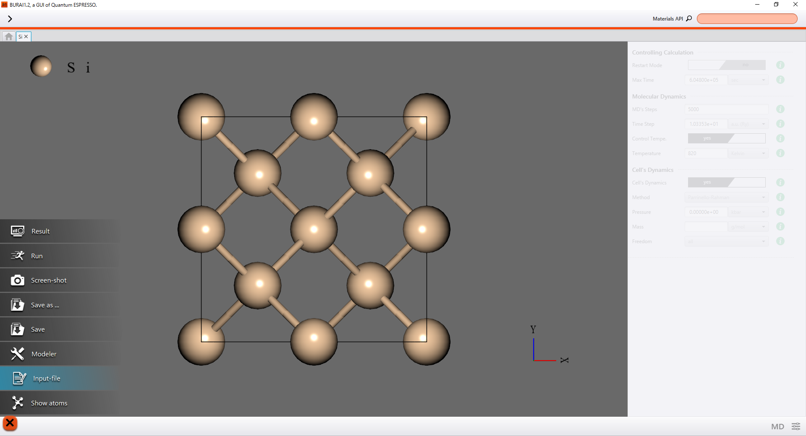
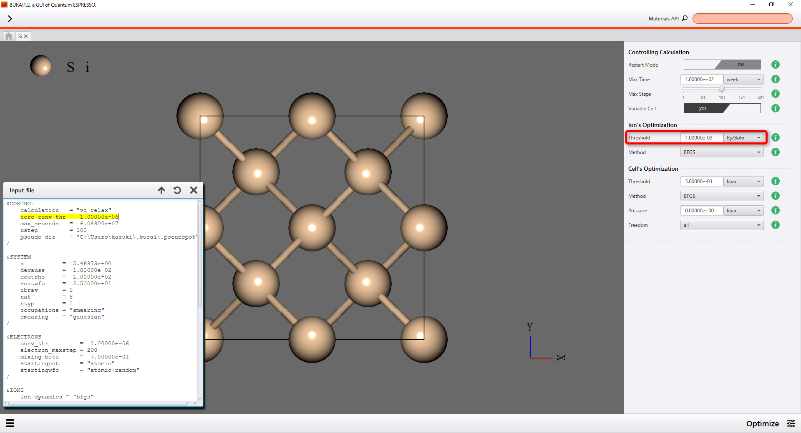
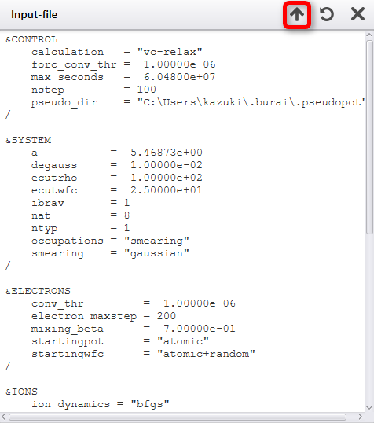
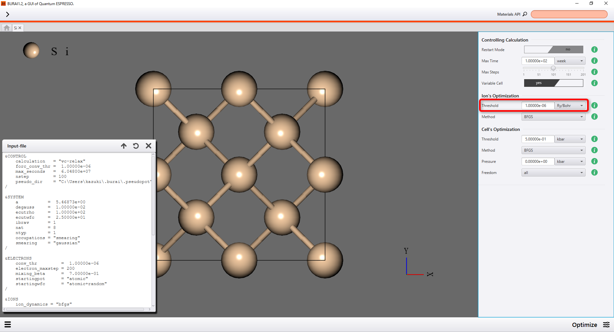
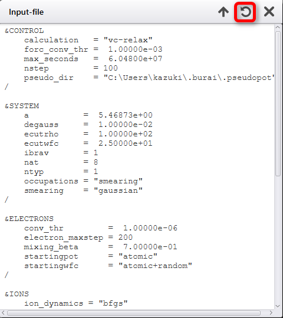

Input Editor (Build-in Text Editor)
===================================

Project tab has *build-in* text editor, which can edit input file of QE.
This editor can show and modify input file with *text*.
You select "Input-file" from left menu, to display the editor.

Upload
------

After the modification of input editor, pushing the upload button reflects it to project tab.

Reload
------

After the modification of project tab, pushing the reload button reflects it to input editor.

|
