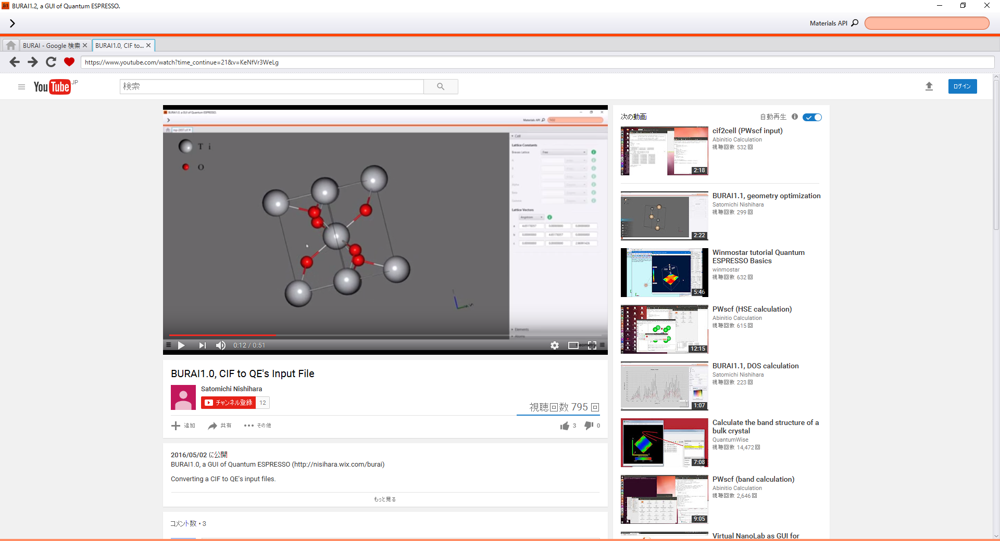
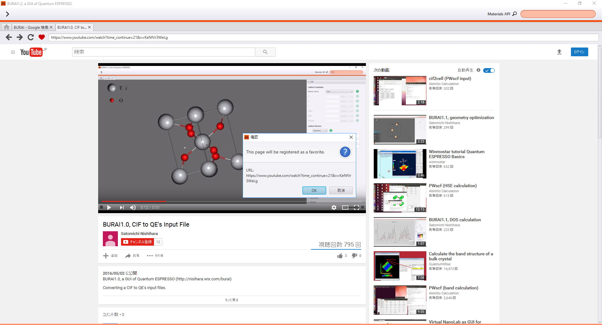
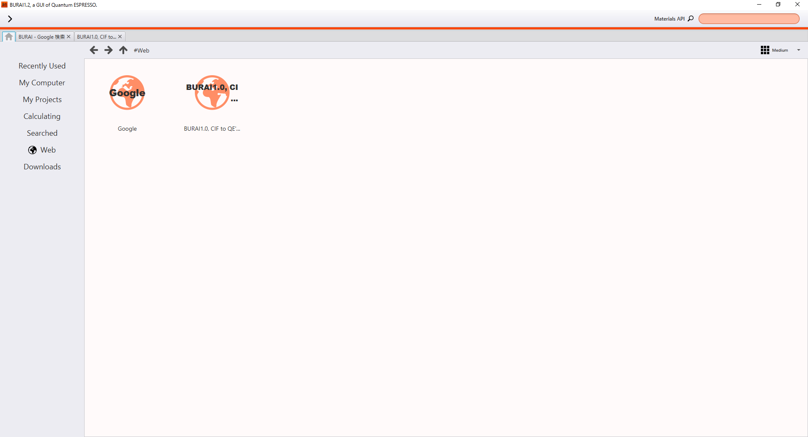

Web Browser
===========

Usage
-----

Users can handle BURAI as the internet explore, too.
When users search something at the internet, users should select "Web" in this system control.
Google URL have been resisted at bookmark as default.

.. image:: ../../img/imgWeb_default.png
   :scale: 30 %
   :align: center

Some Links
----------
Users can add URL address to the favarite links of BURAI.
if you add to the favarite links of BURAI, you should push the heart mark of BURAI.
Then, The URL is added.

|

|

Getting Crystal Structures
--------------------------

On this system, users search the crystal structure which users want to calculate, and users can easily handle as the model.
This chapter introduces the getting the crystal data from some web site.
Firstly, users search the crystal data from this system web explorer.
Next, users have to click the crystal data link.
The moment users click the link, The window which includes the  crystal model and information, appears on this system.
Users click the model of the window, then the crystal structure is shown in this system.

.. image:: ../../img/imgWeb_searchNaCl00.png
   :scale: 30 %
   :align: center

.. image:: ../../img/imgWeb_searchNaCl01.png
   :scale: 30 %
   :align: center

.. image:: ../../img/imgWeb_searchNaCl02.png
   :scale: 30 %
   :align: center

Getting Pseudopotentials
------------------------

Users can download and get pseudopotentials like Getting Crystal Structures.
This chapter introduces the getting the pseudopotential from some web site.

.. image:: ../../img/imgWeb_searchPP00.png
   :scale: 30 %
   :align: center

.. image:: ../../img/imgWeb_searchPP01.png
   :scale: 30 %
   :align: center

.. image:: ../../img/imgWeb_searchPP02.png
   :scale: 30 %
   :align: center

