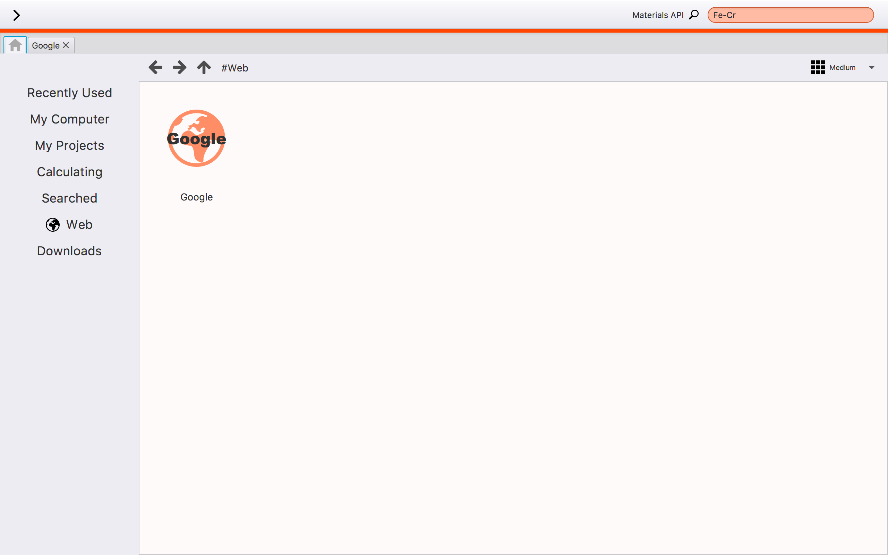
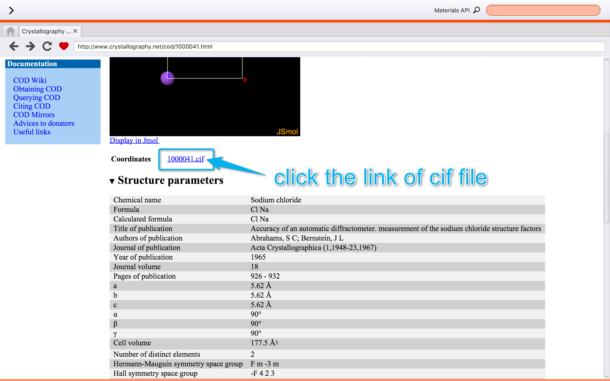
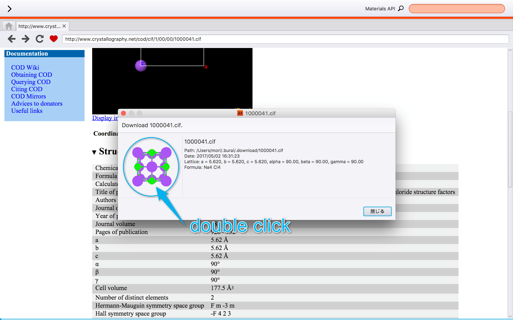

Web Browser
===========

Usage
-----

Users can use BURAI as the internet explore, too.
When users search something at the internet, users should select "Web" in this system control.
Google URL have been resisted at bookmark as default.

Some Links
----------

Getting Crystal Structures
--------------------------

On this system, users search the crystal structure which users want to calculate, and you can easily use as the model.
This chapter introduces the getting the crystal data from some web site.
Firstly, users search the crystal data from this system web explorer.
Next, users have to click the crystal data link.
The moment users click the link, The window which includesthe  crystal model and information, appears on this system.
Users click the model of the window, then the crystal structure is shown in this system.

.. image:: ../../img/imgWeb_searchNaCl02.png
   :scale: 30 %
   :align: center

Getting Pseudopotentials
------------------------

